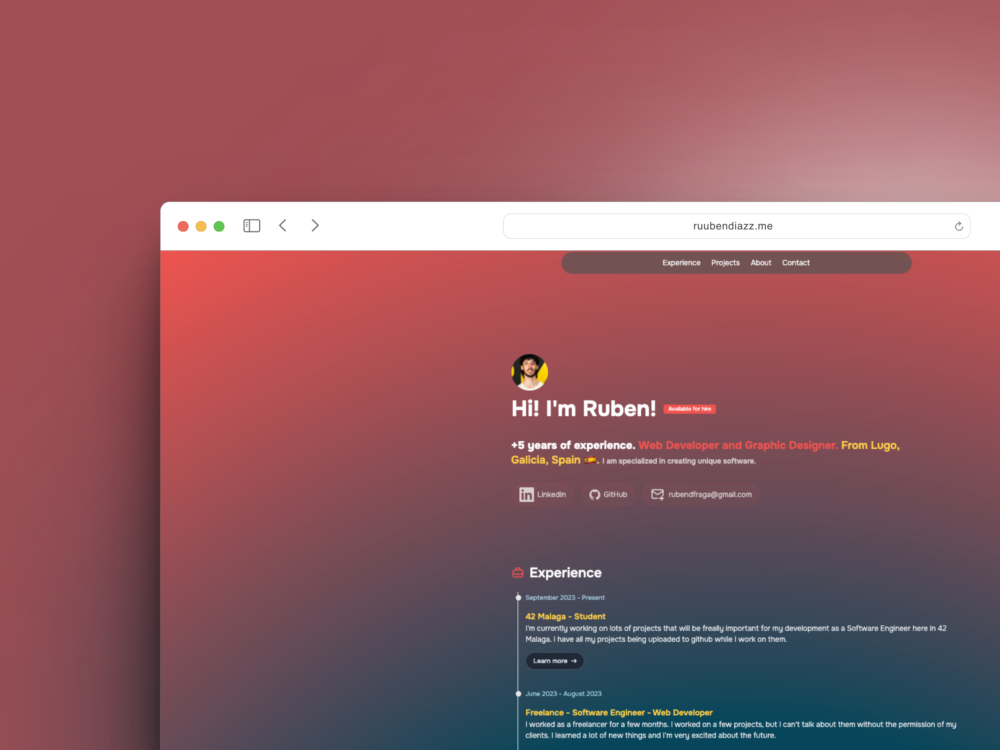

  

<h1 align="center">Ruben Diaz's Portfolio</h1>

  <strong>Welcome to my portfolio!</strong>
   
  This repository contains the source code for my personal portfolio website. It showcases my skills, experience, and projects I've worked on.

## 🚀 Technologies Used

This portfolio is built using the following technologies:

- [**Astro**](https://astro.build/): A front-end framework for building fast, optimized websites.
- [**TypeScript**](https://www.typescriptlang.org/): A statically typed superset of JavaScript that adds types and compiles to plain JavaScript.
- [**Tailwind CSS**](https://tailwindcss.com/): A utility-first CSS framework for rapidly building custom designs.

## 📁 Project Structure

The project has a specific structure to make it easy to navigate:

- `public/`: Contains static files like images.
  - `projects/`: Contains project showcase images.
- `src/`: Contains the source code of the portfolio.
  - `components/`: Contains reusable Astro components.
    - `AboutMe.astro`: The About Me component.
    - `Badge.astro`: The Badge component.
    - `ContactForm.astro`: The Contact Form component.
    - `Experience.astro`: The Experience component.
    - `ExperienceItem.astro`: The Experience Item component.
    - `Footer.astro`: The Footer component.
    - `Header.astro`: The Header component.
    - `LinkButton.astro`: The Link Button component.
    - `Projects.astro`: The Projects component.
    - `SectionContainer.astro`: The Section Container component.
    - `SocialPill.astro`: The Social Pill component.
    - `icons/`: Contains icon components.
      - `AstroIcon.astro`: The Astro Icon component.
      - `Briefcase.astro`: The Briefcase Icon component.
      - `Code.astro`: The Code Icon component.
      - `...`: More icon components.

## 🛠️ Setup

To run this project locally, follow these steps:

1. Clone the repository
2. Install dependencies with `npm install`
3. Start the development server with `npm run dev`

## 📝 License

This project is licensed under the MIT License. Feel free to use it as a template for your own portfolio!

## 📫 Contact

I'd love to connect! Feel free to reach out if you have any questions, or if you want to discuss something:

- Email: rubendfraga@gmail.com
- LinkedIn: [Ruben Diaz](https://www.linkedin.com/in/ruubendiazz)
- GitHub: [rubendiazzz](https://github.com/rubendiazzz)